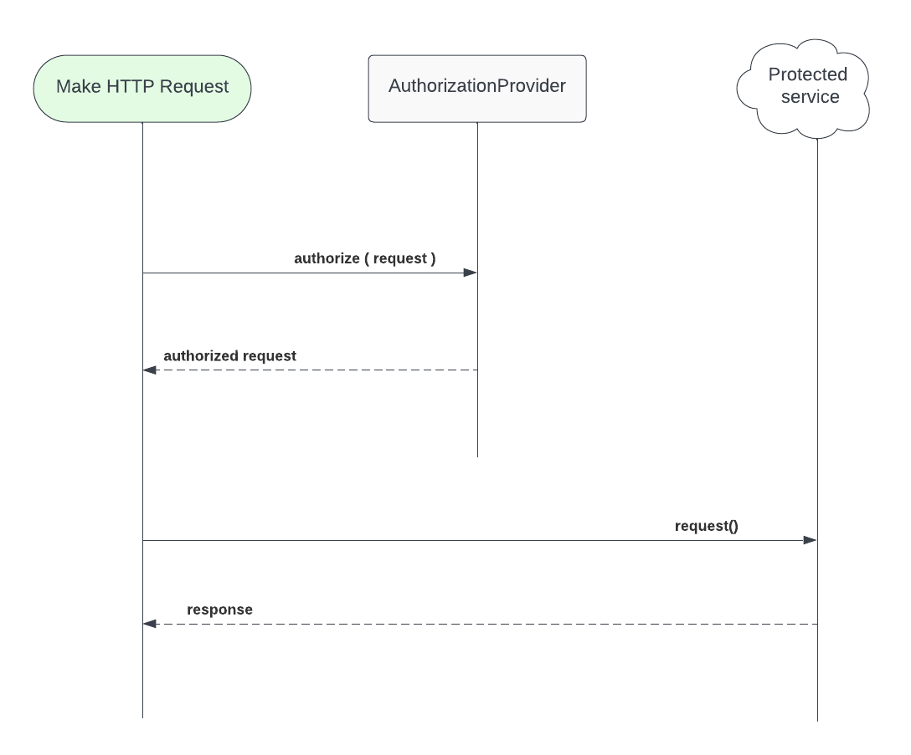
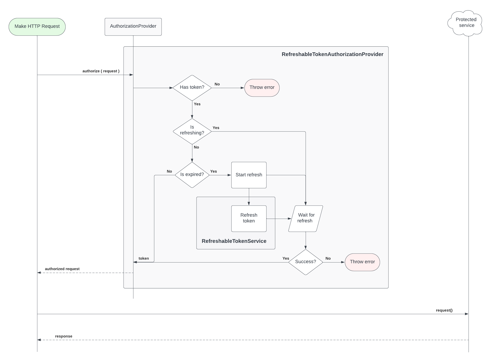
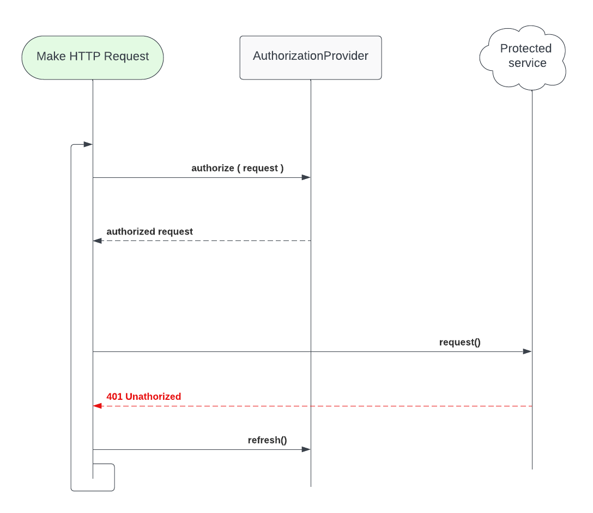

# AuthorizationProvider

`AuthorizationProvider` is a protocol (and set of types) for providing "Authorization" http header values for making network requests.



## BearerTokenAuthorization

A [`BearerTokenAuthorization`](../Sources/Evident/Networking/Authorization/Providers/BearerTokenAuthorization.swift) provider authorizes a `URLRequest` by adding an "Authorization" HTTP header with a constant token value - e.g., "Authorization: Bearer 123456".

### Usage

```swift
let sharedAuth = BearerTokenAuthorization(token: "ABC")

func getListOfWidgets() async throws -> [Widget] {
  var request: URLRequest = ...
  
  // Authorize the request:
  try await request.authorize(using: sharedAuth)
  
  let (data, response) = try await URLSession.shared.data(for: request)
  ...
}
```


## RefreshableTokenAuthorization

A [`RefreshableTokenAuthorization`](../Sources/Evident/Networking/Authorization/Providers/RefreshableTokenAuthorization/RefreshableTokenAuthorization.swift) provider authorizes a `URLRequest` by adding an "Authorization" header value based on a token, where a `RefreshableTokenAuthorization` sometimes needs to reach out to another service in order to refresh a token (e.g., OAuth, OIDC).

The goals of this provider are:

- Transform a `URLRequest` to be an "authorized" request, by setting an appropriate "Authorization" HTTP header based on a token.
- If a token is expired, the authorization provider suspends the `URLRequest` transformation, and starts to refresh the token.
- All future `URLRequest` transformations are suspended while a token refresh is in progress
- When a refresh finishes, all suspended `URLRequest` transformation requests are resumed
- Cancelling a `URLRequest` transformation request that indirectly started a token refresh does not cancel the token refresh, and any other suspended requests will still resume with a refreshed value.

The service that performs a refresh is abstracted out into a `RefreshableTokenService`, in order to keep the provider focused solely on being a state machine for authorizing requests.

A standard token refresh, as implemented here, follows the logic below:


### Basic Usage

Set up a shared instance of a `RefreshableTokenAuthorization` provider (and a `RefreshableTokenService`) - e.g.:

```swift
let sharedTokenService = MyTokenService()
let sharedAuthProvider = RefreshableTokenAuthorization(
  service: sharedTokenService
)
```

It is important that all requests which use the same authorization identity, use the same shared `AuthorizationProvider` instance. For example, in apps where there is only ever one signed in user, there should be a shared singleton instance of your authorization provider.

Use the shared instance to authorize HTTP requests - e.g.:

```swift
func getListOfWidgets() async throws -> [Widget] {
  var request: URLRequest = ...
  
  // Authorize the request:
  try await request.authorize(using: sharedAuthProvider)
  
  let (data, response) = try await URLSession.shared.data(for: request)
  ...
}
```

### Handling 401 Unauthorized responses

While tokens have "isExpired" logic to know when they have expired _before_ attempting to authorize a `URLRequest`, there are times when a token may be externally invalidated. This can happen for various reasons, but the end effect is that an authorized request to a protected service _may_ respond with a `401 Unauthorized` HTTP status. The common practice in this case is to manually try refreshing a token, re-authorize the request, and try making the request again.



Adapting the above simple example could look something like this (moves the `URLRequest` authorization into a separate func to allow retrying the same original request):

```swift
func getListOfWidgets() async throws -> [Widget] {
  let request: URLRequest = ...
  let (data, response) = try await send(request)
  ...
}

/// In order to prevent an infinite loop of unathorized requests,
/// only try a fixed number of refreshes.
func send(
  _ request: URLRequest,
  refreshCount: Int = 1
) async throws -> (Data, URLResponse) {
  
  let authorizedRequest = try await sharedAuthProvider.authorize(request)
  let (data, response) = try await URLSession.shared.data(for: authorizedRequest)
  
  status = (URLRequest as? HTTPURLRequest)?.statusCOde ?? 0
  if status == 401 && refreshCount > 0 {
    // Tell the provider to refresh:
    try await sharedAuthProvider.setNeedsRefreshAfterUnauthorizedResponse(for: authorizedRequest)
    // Try the original request again (recursively):
    return try await send(request, refreshCount: refreshCount - 1)
  }
  
  guard status == 200 else {
    throw ServiceError(status)
  }
  return (data, response)
}
```

### (Re)Initialization

An app that uses a token refresh flow usually needs some way to restore a token from storage at app launch (i.e., from the Keychain), and/or allow users to login.

#### Set an immediate token

Immediately set the token for a `RefreshableTokenAuthorization` provider instance:

```swift
await sharedAuthProvidet.setToken(token)
```

All pending (and future) "authorize `URLRequest`" tasks will resume using the new token value.

#### Manually "refresh" a token

Supporting user login is achieved by "refreshing" a token while providing an async method that runs the refresh.  I.e., a token refresh that uses a custom method instead of the provider's `RefreshableTokenService` `refresh()` method.

```swift
await sharedAuthProvider.refresh {
  let token = try await sharedTokenService.login(username, password)
  // opportunity to do something with the username here
  return token
}
```

This puts the provider into a "refreshing" state. All following "authorize `URLRequest`" calls will wait for the custom refresh to finish, and will resume using the new token value.

#### Logout

A `RefreshableTokenAuthorization` provider can be reset to support "logout" functionality:

```swift
await sharedAuthProvider.reset()
```

All pending "authorize `URLRequest`" tasks will throw a `NotAuthorized` error.

### Listening for changes

`RefreshableTokenAuthorization` supports listening for changes to its token value, which can be used to drive any number of things, like updating a Keychain item, fetching User profile info, etc.

```swift
let cancellable = sharedAuthProvider.onTokenChange { message in
 switch message {
   
   case .tokenInvalidated(let error):
   print("Token no longer valid: \(error)")
   removeTokenFromKeychain()
   
   case .tokenUpdated(let token):
   saveTokenToKeychain(token)
 }
}
```

Multiple token change handlers can be added / removed.

