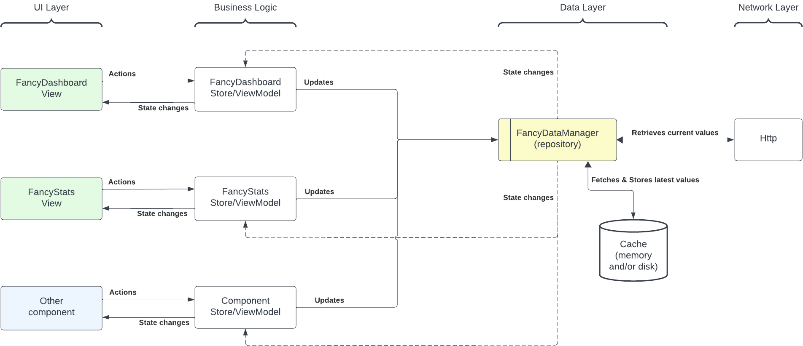

# Data Manager

A "data manager" is an abstraction layer that can be thought of as a "repository". It provides read access to some data, which can be observerd for changes.  It provides write access through dedicated methods, where there is an opportunity for extra business logic and/or communication with a [back end] service. A data manager will nearly always be a singleton, providing data to various layers and parts of your app.



For example, if you had a `MyData` structure with properties:

```swift
struct MyData: Equatable {
  var name: String
  var number: Int
}
```

Here's how you might declare a `MyDataManager`:

```swift
actor MyDataManager {
    
    // MARK: - Public API
    
    /// Observable `MyData` value
    let myData: ManagedValue<MyData>
    
    func updateName(value: String) async throws {
        // 1. (todo) apply extra business logic (validation, etc.)
        // 2. (todo) call some back end service to update a remote value
        
        // 3. update the managed value:
        await setter.set(\.name, value: value)
    }
    
    func updateNumber(value: Int) async throws {
        // 1. (todo) apply extra business logic (validation, etc.)
        // 2. (todo) call some back end service to update a remote value
        
        // 3. update the managed value:
        await setter.set(\.number, value: value)
    }
    
    // MARK: - Private implementation details
    
    private let setter: ManagedValue<MyData>.Setter
    
    init() {
        // During initialization, a `ManagedValue` is created, providing
        // Two tools for working with the value:
        // - a read-only ManagedValue instance that is used for observation;
        // - a "setter" for updating the value.
        // This separation of concerns protects how the value can be updated,
        // allowing you precise control over how vaues are updated.
        (myData, setter) = ManagedValue.create(
            defaultValue: MyData(name: "", number: 0)
        )
    }
}

//  Usage:
extension MyDataManager {
    static let shared = MyDataManager()
}

let cancellable = MyDataManager.shared.myData.observe(\.name) { name in
    print("Name is now: \(name)")
}

try await MyDataManager.shared.updateName(value: "Jo")
```